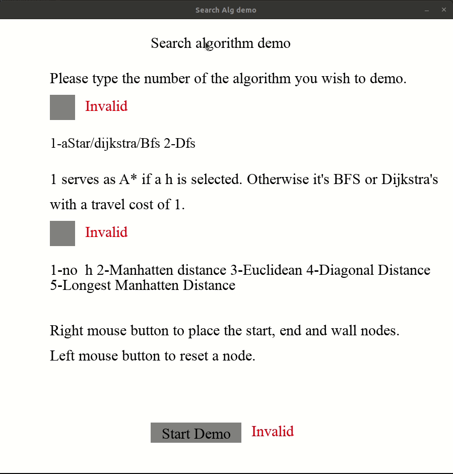
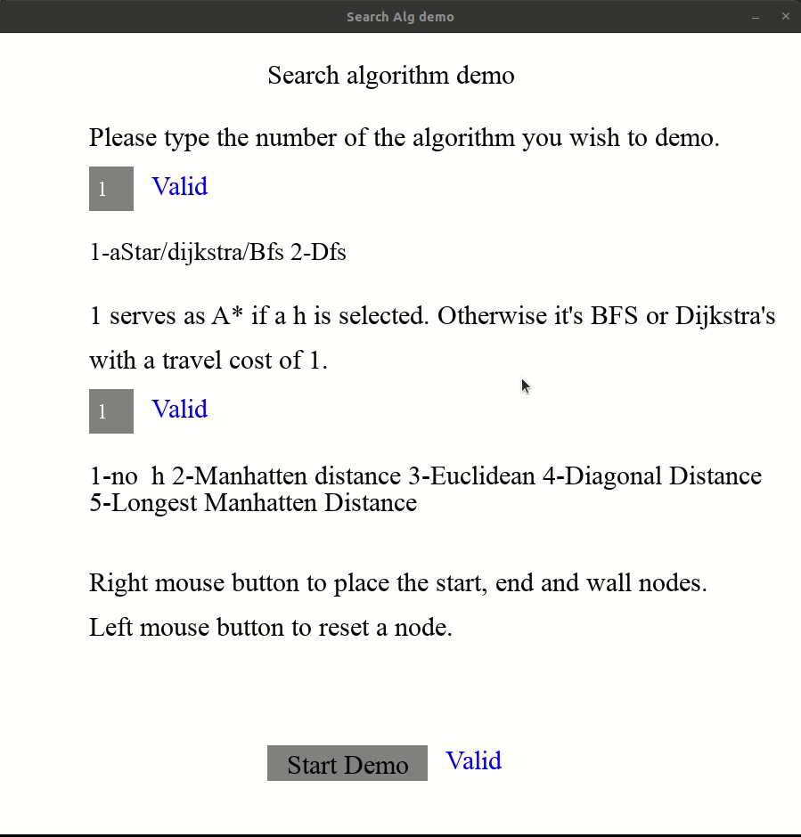
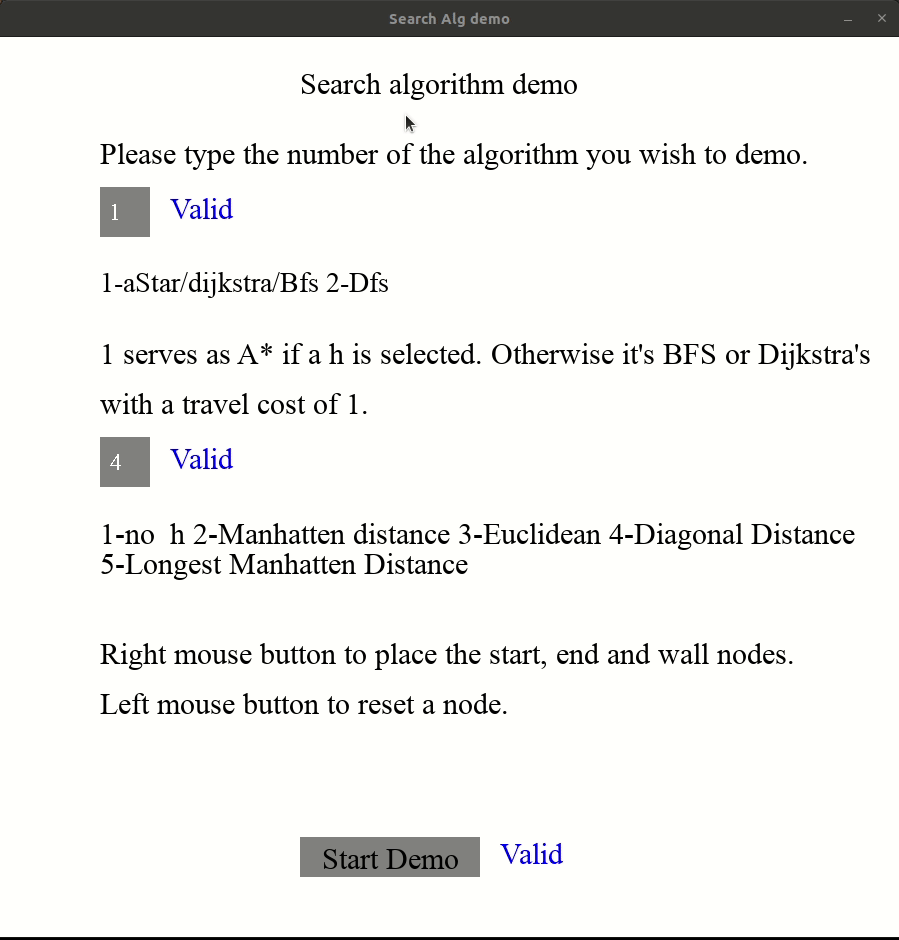

# searchAlgs

## Demo

A star with no heuristic. Basically Dijkstra's with path weight of 1/BFS. 

A Star with Manhattan distance as the heuristic.

A Star with Euclidean Distance as the heuristic.

A Star with Diagonal Distance as the heuristic.

Depth First Search

## Inspired by

[A* Pathfinding Visualization Tutorial - Python A* Path Finding Tutorial](https://youtu.be/JtiK0DOeI4A)

